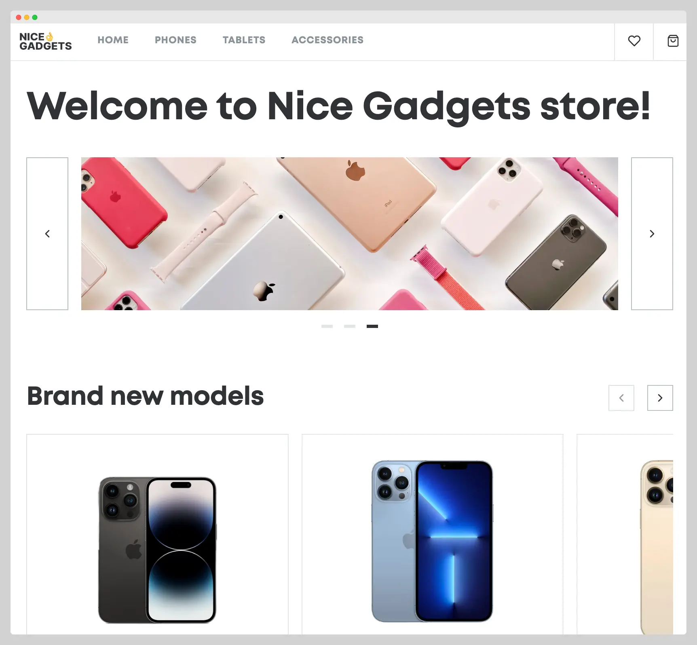
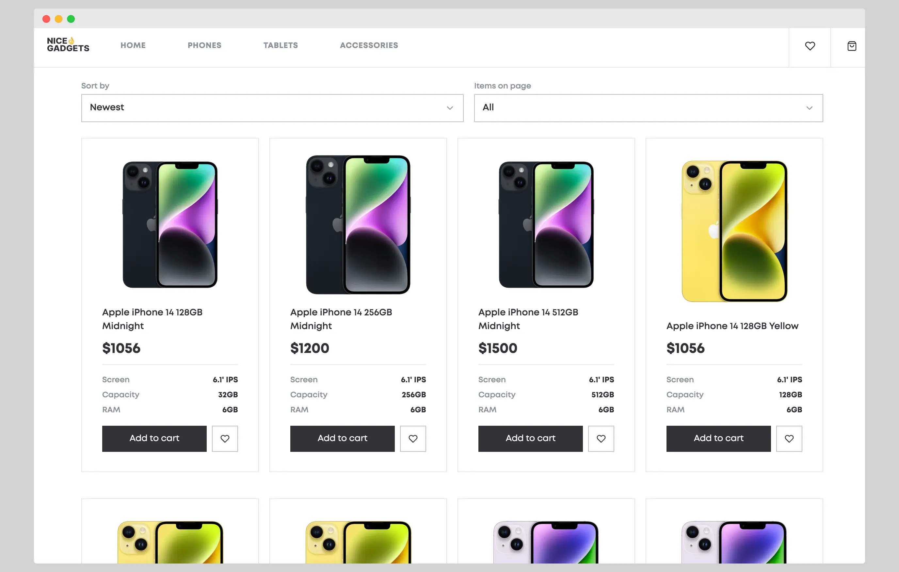
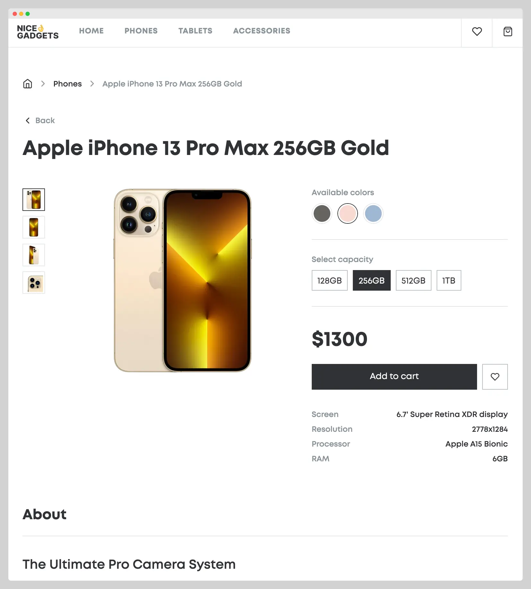
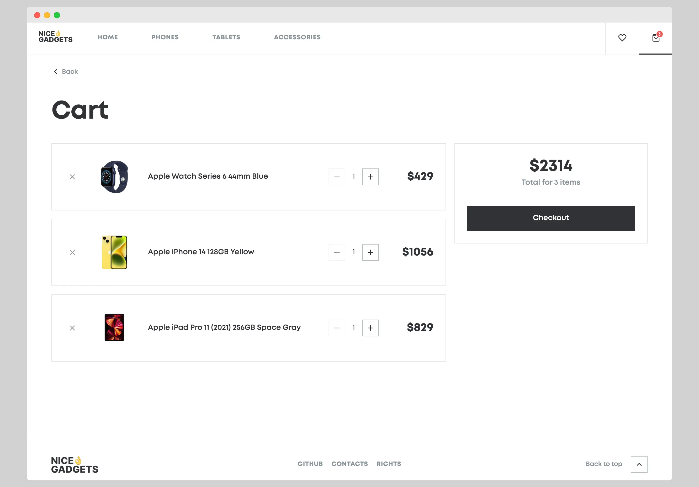

# Nice Gadgets Store

Full-featured e-commerce catalog for phones, tablets, and accessories. Built with React, TypeScript, and Redux to practice modern web development patterns.

**Live Demo:** [https://mykhailonl.github.io/phone-catalog-2025/](https://mykhailonl.github.io/phone-catalog-2025/)

## Features

**Product Catalog**
- Browse phones, tablets, and accessories with full product details
- Sort by newest, alphabetically, or price
- Flexible pagination — choose 4, 8, 16 items per page, or view all
- Each product shows specs, multiple images, and available colors/capacities

**Product Details Page**
- Large image gallery with multiple photo previews
- Select color and storage capacity to view different variants instantly
- Full technical specifications and product description
- "You may also like" section with random product recommendations

**Shopping & Favorites**
- Add products to cart with quantity management
- Save favorites for later
- Both cart and favorites persist using localStorage
- Badge counters on header icons show item counts

**User Experience**
- Sticky header with navigation and quick access to cart/favorites
- Breadcrumb navigation on product pages
- Smooth page transitions and hover effects
- Responsive design for mobile, tablet, and desktop
- Back button to return to previous page

## Screenshots

### Home Page with Featured Sliders


### Catalog with Sorting & Pagination


### Product Details with Customization


### Shopping Cart Management


## Tech Stack

- **React 18.3** with TypeScript
- **Vite** for build tooling
- **Redux Toolkit** for state management (cart, favorites, UI states)
- **React Router v6** for navigation
- **TanStack React Query** for data fetching and caching
- **SCSS Modules** for component-scoped styling
- **ESLint & Prettier** for code quality

## Getting Started

### Prerequisites
- Node.js 20+
- npm or yarn

### Installation

```bash
git clone https://github.com/mykhailonl/phone-catalog-2025.git
cd phone-catalog-2025

npm install
npm run dev
```

The app runs at `http://localhost:5173/phone-catalog-2025`

## Available Scripts

```bash
npm run dev       # Start development server
npm run build     # Build for production
npm run preview   # Preview production build
npm run lint      # Run ESLint checks
npm run format    # Format code with Prettier
npm run test      # Run Cypress tests
npm run deploy    # Deploy to GitHub Pages
```

## Project Structure

```
src/
├── components/       # 40+ reusable components
│   ├── ItemCard/     # Product detail page
│   ├── ProductSlider/ # Featured product carousel
│   ├── Slider/       # Image carousel
│   ├── Header/       # Navigation header
│   ├── CartItem/     # Shopping cart item
│   └── ...
├── features/         # Redux slices
│   ├── cart/         # Cart state management
│   ├── favorites/    # Favorites state
│   ├── dropdown/     # Dropdown UI state
│   ├── scroll/       # Scroll position tracking
│   └── ...
├── pages/            # Page components
│   ├── HomePage/
│   ├── CartPage/
│   ├── ProductPage/
│   └── ...
├── hooks/            # Custom hooks
├── types/            # TypeScript interfaces
├── styles/           # Global SCSS utilities
└── utils/            # Helper functions
```

## How It Works

**Data Loading**
Products are loaded from JSON files in `public/api/` and cached using React Query. The same product data is used across all pages.

**State Management**
Redux Toolkit manages three main features:
- **Cart**: Add/remove items, adjust quantities
- **Favorites**: Toggle favorites on/off
- **UI State**: Dropdown visibility, sidebar menu, scroll position

**Styling**
Each component has its own SCSS Module, keeping styles isolated and maintainable. Global utilities for responsive grid, typography, and colors are imported by all components.

**Navigation**
React Router handles all page transitions. URL parameters are used to remember catalog filters and sort preferences.

**Storage**
Cart and favorites are synced to localStorage on every change and restored on page load, so your selections persist across sessions.

## Browser Support

- Chrome (latest)
- Firefox (latest)
- Safari (latest)
- Edge (latest)

## License

Open source project.
